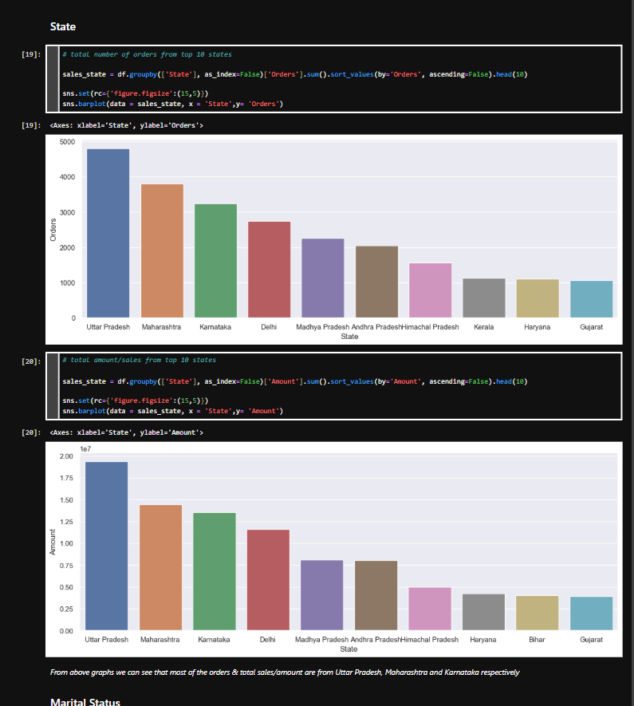

# Diwali Sales Exploratory Data Analysis (EDA)

## Project Overview
This project performs a comprehensive Exploratory Data Analysis (EDA) on Diwali sales data using Python. The goal is to analyze customer purchasing behavior across different demographics (gender, age, state, occupation) to provide actionable insights for improving customer experience and increasing revenue.

## Key Objectives
* Perform data cleaning and preparation (handling null values, data type conversion).
* Analyze sales trends based on gender, age groups, and marital status.
* Identify top-performing states and product categories.
* Provide a final summary of the "ideal customer" profile to guide marketing strategies.

##  Featured Analysis: Geographical Performance

> **Strategic Insight:** Most orders and total sales are concentrated in **Uttar Pradesh, Maharashtra, and Karnataka**. Targeting these high-purchasing regions can significantly optimize marketing spend and supply chain logistics.

## Technologies Used
* **Language:** Python
* **Libraries:** Pandas, NumPy, Matplotlib, Seaborn
* **Environment:** Jupyter Notebook
  
## Dataset
The dataset includes details of transactions during the Diwali period, including:
* User ID, Product ID, Gender, Age Group, Marital Status, State, Occupation, and Amount.

## Insights & Findings
* **Gender:** Married women aged 26-35 years are the highest contributors to sales.
* **Geography:** Top 3 states with maximum sales/orders are Uttar Pradesh, Maharashtra, and Karnataka.
* **Occupation:** Most buyers work in the IT Sector, Healthcare, and Aviation.
* **Categories:** Food, Clothing, and Electronics are the most popular product categories.

## How to Run
1. Clone the repository: `git clone https://github.com/YOUR_USERNAME/Diwali-Sales-Analysis.git`
2. Install dependencies: `pip install pandas numpy matplotlib seaborn`
3. Open `Diwali_Sales_Analysis.ipynb` in Jupyter Notebook or VS Code.

---
##  Author
**Suraj**
* **GitHub:** [@surajyadav011](https://github.com/surajyadav011)
